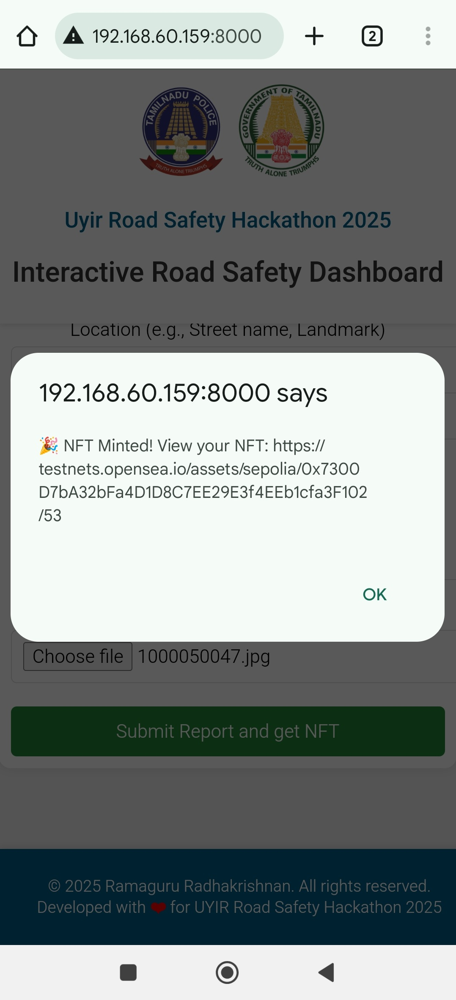

# UYIR Road Safety Hackathon   

## Citizen Reporting Portal
Citizen Engagement is very important in keeping them aware, ensure they stay responsible for their actions and finally they volunteer to report other known issues/violations and road safety concerns.

### Screenshots

<h6 align="center">Citizen Reporting Portal User Interface</h6>

   

<h6 align="center">NFT-based Reward Notification (NFT issued in OpenSea)</h6>

    

<h6 align="center">Citizen Reporting Portal Console Log</h6>

  

