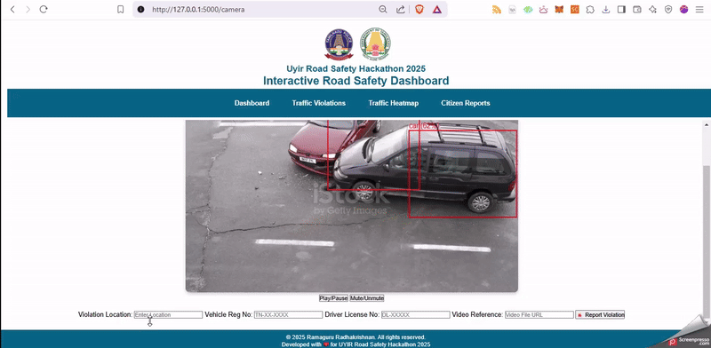
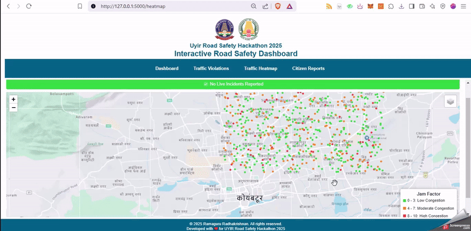

# UYIR Road Safety Hackathon    

## Interactive Dashboards
- Blockchain-enabled Traffic Violations Reporting
- Real-Time Traffic Monitoring (using HERE Traffic REST API)
- Citizen Reports
- Accident Hotspots

### Screenshots and Sample Videos

<h6 align="center">Accident Detection</h6>

   

<h6 align="center">Accident Reporting to Blockchain</h6>

   

<h6 align="center">Real-time Traffic Flow Data using HERE Traffic API</h6>

   

